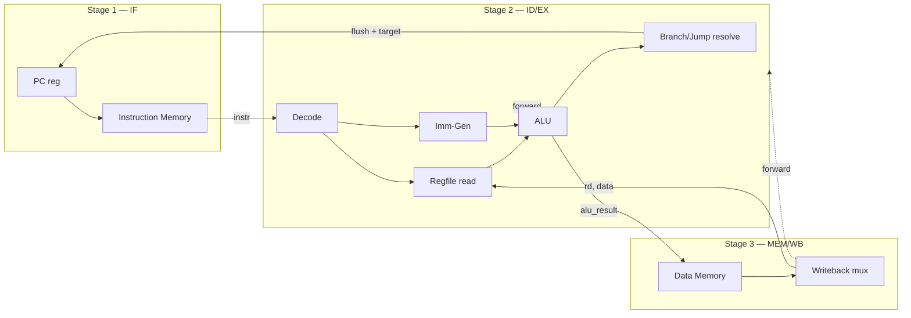

# CCRISC-V — a 3-stage RV32I core

A small, synthesizable **3-stage pipelined RISC-V core** implementing the
full **RV32I** base integer ISA (the mandatory minimum of the RISC-V
Unprivileged spec), with a complete Verilator-based verification flow that
compiles and runs *real* RISC-V assembly and C programs.

See [ACTION_PLAN.md](ACTION_PLAN.md) for the design rationale and scope
decisions.

## Pipeline diagram

```
                     ┌──────────────────┐
                 ┌──▶│   PC + 4 / target │◀────────────────────────┐
                 │   └─────────┬────────┘                          │
                 │             │ pc                                │ branch/jump
                 │             ▼                                   │ target + taken
                 │   ┌───────────────────┐                          │ (flush)
                 │   │  STAGE 1 : IF     │                          │
                 │   │  instruction mem  │                          │
                 │   │  (imem, comb rd)  │                          │
                 │   └─────────┬─────────┘                          │
                 │        pc / instr                                │
                 │             ▼                                    │
                 │   ┌────────────────────────────────────────┐     │
                 │   │  STAGE 2 : ID / EX                     │     │
                 │   │  decode → regfile read → imm-gen        │     │
                 │   │  ALU execute · branch compare + target  │─────┘
                 │   │        ▲              ▲                 │
                 │   │        │ fwd A         │ fwd B           │
                 │   └────────┼──────────────┼──────────────────┘
                 │            │              │        alu_result / mem_addr / store data
                 │            │              │                    ▼
                 │   ┌────────┴──────────────┴─────────────────────────┐
                 │   │  STAGE 3 : MEM / WB                              │
                 │   │  data mem access (load/store, comb rd, sync wr)  │
                 │   │  writeback mux → register file write             │
                 │   └───────────────────────┬───────────────────────────┘
                 │                           │ rd, wb_data  (forwarded to stage 2,
                 └───────────────────────────┘  and written into regfile same cycle)
```



## Repository layout

```
rtl/            core RTL (pure, no testbench code)
  riscv_pkg.sv    opcode/funct3/funct7 constants, ALU-op enum
  regfile.sv      32x32 register file, x0 hardwired to 0
  alu.sv          combinational ALU
  imm_gen.sv      I/S/B/U/J immediate generation
  decoder.sv      instruction -> control signal decode
  hazard_unit.sv  forwarding + branch-flush control
  if_stage.sv     stage 1 (PC + fetch)
  idex_stage.sv   stage 2 (decode/regfile/ALU/branch)
  memwb_stage.sv  stage 3 (data mem + writeback)
  riscv_core.sv   top-level core, wires the 3 stages together

soc/            simulation SoC shell around the core
  imem.sv, dmem.sv   behavioral memories, loaded via $readmemh
  soc_top.sv         core + memories + tohost/UART MMIO

sim/            Verilator C++ testbench
  sim_main.cpp    drives clock/reset, VCD dump, tohost pass/fail check
  Makefile        builds the Verilator model

sw/common/      bare-metal startup code shared by all tests
  crt0.S          reset entry: set up sp, call main, report to tohost
  link.ld         linker script (text @ 0x0, tohost @ 0x1000_0000)
  tohost.h        pass()/fail()/putchar() helpers for asm & C

tests/asm/*.S   directed assembly tests (one concern each)
tests/c/*.c     end-to-end C programs (fib, sort, checksum)

Makefile        top-level: build sim once, compile+run any test
```

## Memory map

| Address           | Purpose                                             |
|-------------------|------------------------------------------------------|
| `0x0000_0000` +   | Unified RAM image (code + data + stack), 64 KiB default |
| `0x1000_0000`     | `tohost` word: write 0 = PASS, nonzero = FAIL code, ends sim |
| `0x1000_0004`     | UART TX byte: write ASCII byte, printed to sim stdout |

## Building & running

Requires `riscv32-unknown-elf-gcc` (or `riscv64-unknown-elf-gcc` with rv32
multilib) and `verilator` on `PATH`.

```sh
# build the Verilator simulation model once
make sim

# assemble/compile a test, run it on the RTL, dump wave.vcd
make test TEST=tests/asm/add.S
make test TEST=tests/c/fib.c

# run every test in tests/asm and tests/c
make test-all

# view the waveform
gtkwave build/wave.vcd
```

Each `make test` prints `PASS` or `FAIL <code>` and exits with that code, so
`make test-all` doubles as a simple regression suite.

## Known limitations (by design)

- No CSR file, no traps/interrupts, no privileged modes — `ECALL`/`EBREAK`/
  `FENCE` decode but are architectural no-ops.
- No M/A/F/D/C extensions — RV32I only.
- Instruction and data memories are separate simulation models both
  initialized from the same image — no self-modifying code.
- No branch prediction (fixed 1-cycle flush penalty) and no memory-latency
  modelling (single-cycle combinational reads) — this keeps the 3-stage
  pipeline free of stalls other than the control-hazard bubble.
